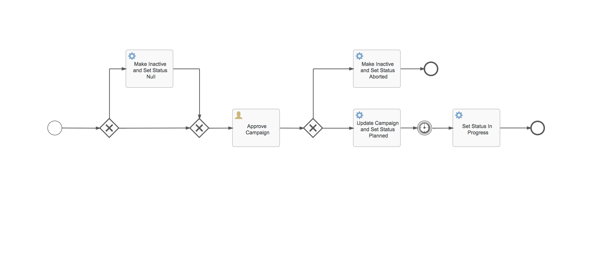

# activiti-cloud-sfdc-integration-example



## Process Flow

1. When new Campaigns are Created in SFDC, Events emitted using SFDC PushTopic 
2. Activiti Cloud Connector (activiti-cloud-connector-sfdc-event-listener) listens to events and kicks off Campaign Approval Process (in activiti-runtime-bundle-campaign-management component) shown above 
3. Interaction with SFDC at various points (service tasks) of the process via another Activiti Cloud Connector (activiti-cloud-connector-sfdc-rest) 
4. If the Campaign is approved, the process will activate the Campaign in SFDC & set the status to In-Progress on Campaign Start Date, else Abort it!

## Click the below link to watch a demo of this project
<a href="http://www.youtube.com/watch?feature=player_embedded&v=TKxS92CVkzE" target="_blank"></a>

#### README to be updated soon with complete instructions! If you can't wait, the key thing is to have a Salesforce Account (https://developer.salesforce.com/signup), populate the SFDC connection properties in kubernetes/application.yml and creation of a PushTopic

```
Open Developer Console -> Go to Debug > Execute Anonymous:

PushTopic pushTopic = new PushTopic();
pushTopic.Name = 'NewCampaignNotification';
pushTopic.Query = 'SELECT ActualCost,BudgetedCost,CampaignMemberRecordTypeId,CreatedDate,EndDate,ExpectedResponse,ExpectedRevenue,Id,IsActive,NumberOfContacts,StartDate,Status,Type FROM Campaign';
pushTopic.ApiVersion = 41.0;
pushTopic.NotifyForOperationCreate = true;
pushTopic.NotifyForOperationUpdate = false;
pushTopic.NotifyForOperationUndelete = false;
pushTopic.NotifyForOperationDelete = false;
insert pushTopic;
```
